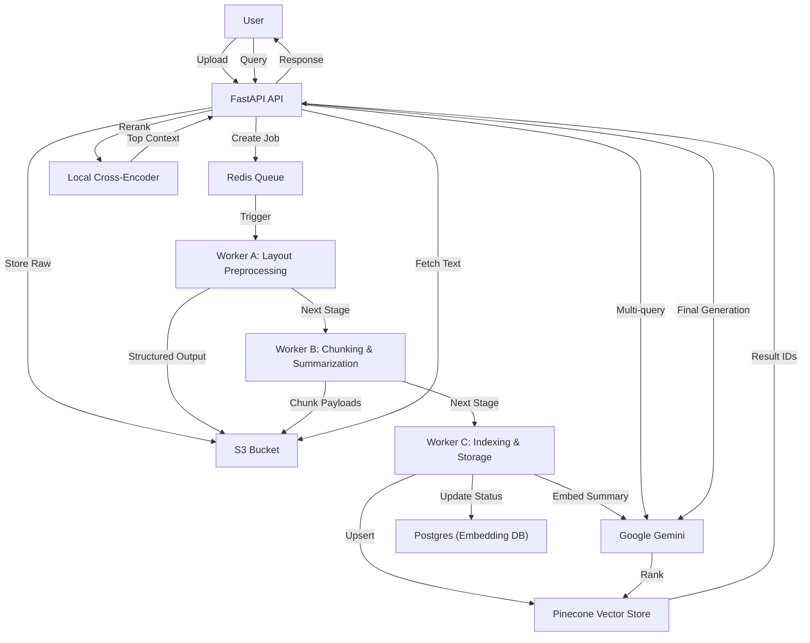

# Pinpoint PDF Architecture

## Overview
Pinpoint PDF is a layout-aware RAG (Retrieval-Augmented Generation) application designed for high-precision document analysis. It uses a multi-stage ingestion pipeline and a sophisticated retrieval strategy to deliver accurate answers from complex PDF documents.

## Core Architectural Decisions

### 1. Three-Database Strategy
The system splits its data across three independent PostgreSQL instances:
- **User DB (`5432`)**: Manages user profiles, authentication, and session metadata.
- **Embedding DB (`5433`)**: Stores document metadata, chunking information, and cross-references.
- **Chat DB (`5434`)**: Dedicated to conversation history and message persistence.
*Rationale: Decouples user management from heavy document processing and chat activity, allowing for independent scaling and maintenance.*

### 2. Async Ingestion Pipeline (Celery + Redis)
Ingestion is broken into three distinct worker stages to ensure reliability and scalability:
- **Worker A (Preprocess)**: Uses an LLM-based layout parser to identify section hierarchies, headers, footers, and tables. This structured data is stored in S3.
- **Worker B (Chunk & Summarize)**: Breaks the structured JSON into logical chunks based on sections. It generates a concise summary for each chunk using Google Gemini.
- **Worker C (Index & Store)**: Embeds the chunk *summaries* (not full text) and indexes them in Pinecone within a document-specific namespace.
*Rationale: Layout-aware parsing preserves context better than naive chunking. Summary-first indexing improves retrieval precision by matching the intent of high-level queries.*

### 3. Sophisticated RAG Retrieval Flow
The retrieval process involves several ranking layers:
1. **Multi-Query Expansion**: Expands the user query into multiple variations to capture different semantic angles.
2. **Vector Search (Pinecone)**: Performs a fast k-NN search across all documents the user has access to, using per-document namespaces.
3. **Reciprocal Rank Fusion (RRF)**: Merges results from multiple query variations into a single ranked list using a rank-aware scoring function.
4. **Local Cross-Encoder Reranking**: Fetches full chunk text from S3 and uses a local model (`ms-marco-MiniLM-L-6-v2`) for high-precision reranking.
*Rationale: Combines the speed of vector search with the precision of cross-encoders, ensuring only the most relevant context is passed to the LLM for generation.*

### 4. Stateless Object Storage (S3/MinIO)
All intermediate artifacts (structured JSON, chunk payloads, raw PDFs) are stored in S3. Workers are stateless and communicate via S3 payloads.
*Rationale: Makes the pipeline resilient to worker failures and facilitates easy re-processing of specific stages.*

---

## Technical Stack
- **Backend**: FastAPI, Celery, Redis
- **Frontend**: React (Vite, Tailwind, Radix UI)
- **Database**: PostgreSQL (SQLAlchemy + Alembic)
- **Vector Store**: Pinecone
- **LLM/Embeddings**: Google Gemini 1.5 Pro
- **Storage**: S3 / MinIO / GCS (HMAC)
- **Reranking**: Sentence Transformers (Local)

## System Flow

